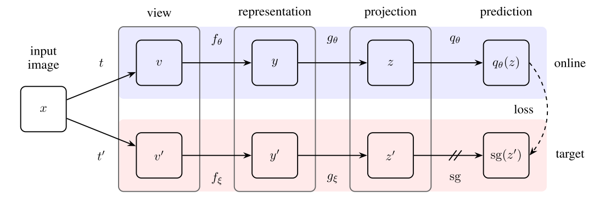

# PyTorch-BYOL
### PyTorch implementation of [ByoL](https://arxiv.org/abs/2006.07733).



## Installation

Clone the repository and run
```
python3 -m venv byol
source byol/bin/activate
pip install requirement.txt
```

## Config

Before running PyTorch BYOL, make sure you choose the correct running configurations on the ```config.yaml``` file.

### Train 
```
python3 main.py
```

## Feature Evaluation

We measure the quality of the learned representations by linear separability.

During training, BYOL learns features using the STL10 ```train+unsupervised``` set and evaluates in the held-out ```test``` set.

|       Linear Classifier      | Feature  Extractor | Architecture | Feature dim | Projection Head  dim | Epochs | Batch  Size | STL10 Top 1 |
|:----------------------------:|:------------------:|:------------:|:-----------:|:--------------------:|:------:|:-----------:|:-----------:|
|      Logistic Regression     |    PCA Features    |       -      |     256     |           -          |    -   |             |    36.0%    |
|              KNN             |    PCA Features    |       -      |     256     |           -          |    -   |             |    31.8%    |
| Logistic Regression  (Adam) |     BYOL (SGD)     |   [ResNet-18](https://drive.google.com/file/d/1Qj01H8cox8067cpCwhHZSQ0nfQl2RHbQ/view?usp=sharing)  |     512     |          128         |   40   | 64          |    70.1%    |
| Logistic Regression  (Adam) |     BYOL (SGD)     |   [ResNet-18](https://drive.google.com/file/d/1CFQZWKfBzAZp56EADYfMgq0HHua3XCQW/view?usp=sharing)  |     512     |          128         |   80   | 64          |    75.2%    |
